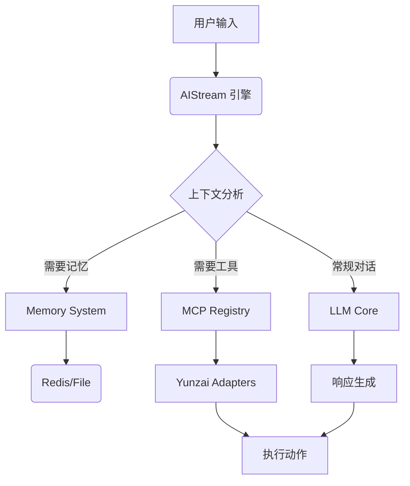

# 风云 AI - 企业级云崽智能助手解决方案

> **重新定义群聊体验，赋予机器人真正的认知与执行力。**

风云 AI 是一款基于 **Model Context Protocol (MCP)** 架构深度打造的云崽 (Yunzai-Bot) 插件。它不仅仅是一个聊天机器人，更是一个具备**长期记忆**、**多模态交互**、**自主工具调用**能力的智能生命体。通过先进的 `AIStream` 工作流引擎，风云 AI 能够理解复杂的上下文，自主决策并执行群管理、情感表达等任务，为您提供企业级的智能交互解决方案。

---

## 🌟 核心特性 (Core Features)

### 🧠 认知记忆系统 (Cognitive Memory System)
打破传统机器人"聊完即忘"的限制。风云 AI 内置分布式记忆库，能够：
- **长期记忆**：自动提取并存储用户的重要信息（如称呼、喜好、历史事件）。
- **场景隔离**：支持群组与个人维度的记忆隔离，确保隐私与上下文准确性。
- **智能检索**：基于语义的动态记忆提取，让每一次对话都充满温度与连贯性。

### 🛠️ MCP 工具协议 (Model Context Protocol)
采用行业领先的 MCP 架构，赋予 AI 真实的执行力：
- **自主决策**：AI 根据对话内容，自主判断是否需要调用工具（如发送表情、管理群聊）。
- **能力扩展**：支持 `reply` (回复)、`at` (艾特)、`poke` (戳一戳)、`setEssence` (设精华)、`announce` (发公告) 等多种原生指令。
- **防重复机制**：独创的工具流防抖设计，彻底解决消息重复、指令空转等痛点。

### 🎭 多模态情感交互 (Multi-Modal Interaction)
拒绝冰冷的文字回复，打造沉浸式拟人体验：
- **情绪感知**：AI 实时分析对话情绪（开心、生气、惊讶等）。
- **表情回应**：根据情绪自动发送对应的表情包或 Emoji 反应，生动传神。
- **视觉识别**：集成先进的视觉模型，支持图片内容深度理解与描述。

### 🛡️ 企业级管控 (Enterprise Control)
专为大规模群组运营设计，提供全方位的管理能力：
- **精细化权限**：支持群组白名单、用户黑名单、全局 AI 模式等多级权限控制。
- **可视化管理**：内置 Web 管理后台，支持零代码配置 AI 参数与行为策略。
- **安全合规**：内置敏感词过滤与风控机制，保障运营安全。

---

## 🚀 快速部署 (Quick Start)

### 环境要求
- **Node.js**: v18.0.0 或更高版本
- **Yunzai-Bot**: v3.0.0 或更高版本
- **Redis**: 推荐安装，用于高性能记忆存储

> 📝 **安装说明**：本项目已集成在云崽全功能包中，请参考主项目文档进行安装。

---

## ⚙️ 配置指南 (Configuration)

风云 AI 支持 **指令配置** 与 **Web 后台** 双重管理模式，满足不同场景需求。

### 1. 常用指令

| 指令 | 描述 | 权限要求 |
| :--- | :--- | :--- |
| `#ai配置登陆` | 获取 Web 管理后台的一次性登录链接 | 主人 |
| `#ai状态` | 查看当前 AI 服务的运行指标与负载 | 主人 |
| `#加入本群ai` | 开启当前群组的 AI 智能回复功能 | 主人 |
| `#关闭本群ai` | 暂停当前群组的 AI 功能 | 主人 |
| `#配置ai模型 <名称>` | 动态切换底层 LLM 模型 (如 gpt-4, claude-3) | 主人 |

### 2. 核心配置项 (`config.json`)

| 模块 | 配置项 | 说明 | 默认值 |
| :--- | :--- | :--- | :--- |
| **API** | `apiConfig.baseUrl` | LLM 服务端点 | `https://api.gptgod.online/v1` |
| | `apiConfig.chatModel` | 主对话模型 | `gemini-3-pro` |
| **触发** | `triggerConfig.prefix` | 唤醒前缀 | `白子` |
| | `triggerConfig.globalAIChance` | 非前缀触发概率 (0-1) | `0.8` |
| **视觉** | `visionConfig.enabled` | 是否开启识图 | `true` |
| **安全** | `whitelist.groups` | 启用的群组列表 | `[]` |

> 💡 **提示**：建议使用 Web 管理后台进行可视化配置，避免 JSON 格式错误。

---

## 🏗️ 架构设计 (Architecture)

风云 AI 基于分层架构设计，确保系统的高内聚低耦合：

- **Stream Layer**: 处理流式响应，实现打字机效果。
- **Logic Layer**: 封装业务逻辑，处理权限校验与上下文构建。
- **Adapter Layer**: 抹平不同 LLM 提供商的接口差异。

---

## 📄 版权说明 (License)

本项目采用 **MIT 协议** 开源。

- 允许个人及商业用途的使用、修改和分发。
- 请在分发时保留原作者的版权声明。
- 本项目仅供技术研究与交流，开发者不对使用过程中产生的任何后果负责。

---

  
Made with ❤️ by FengYun Dev Team

